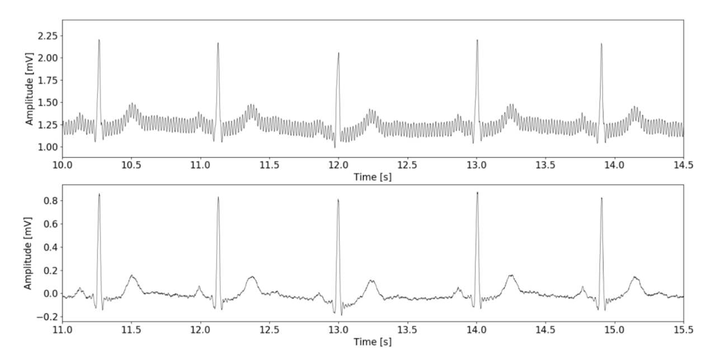
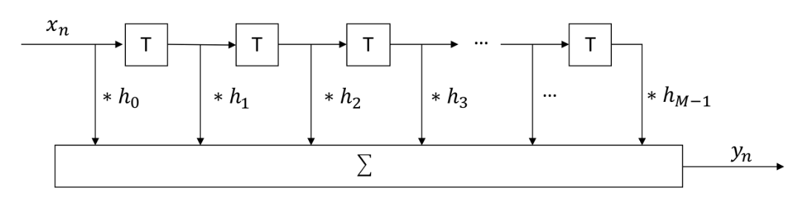
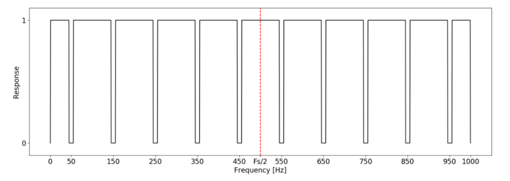
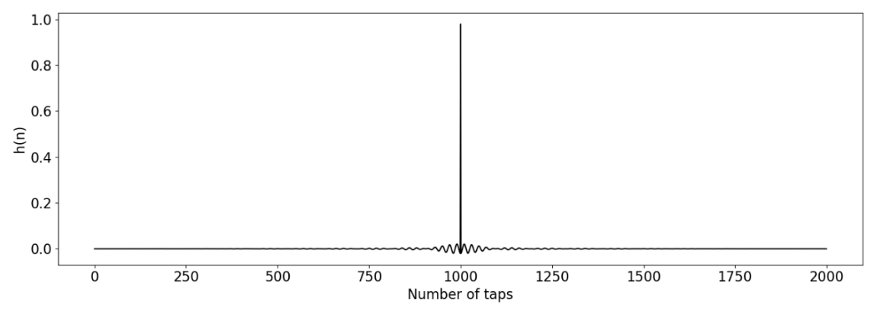
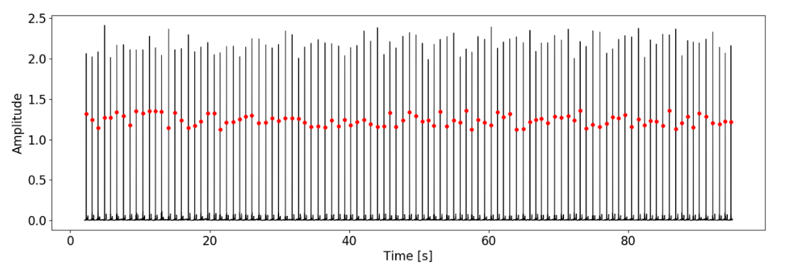

# Java-FIR-Filter

An efficient Java finite impulse response filter implemented using a ring buffer. Once the buffer is filled, the code overwrites the last value with a new one introducing a delay equal to half the number of taps [M].

  

* The filter provides a linear-phase (great for communications applications) and stability
* Filter coefficients can be calculated using the `./coeffs.py` script
* Calculated coefficients will be written and saved to `.coeffs.txt` file

### Filter Topology

  

### Calculating the filter coefficients
* Derive an ideal frequency response of your filter in the frequency domain, example shown below is an ideal frequency response for filtering the 50Hz mains noise and its harmonics from a raw ECG signal

  

* Convert the ideal frequency response to time domain, slice and shift the values to positive time and apply a window function to improve the transition width or the noise attenuation

  

### Using as a matched filter
A matched filter performs the same as an FIR filter, however, the coefficients are calculated differently. Feeding the coefficients derived from a time-reversed template derived from the signal characteristics will boost the signal-to-noise ratio even further.

* Matched filtering for ECG r-peaks

  

